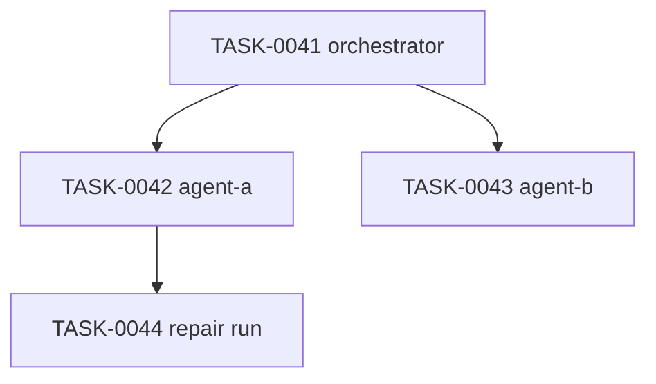

# Plan: Agent Conversation Provenance System

## Repository Structure

This repository (`AI-chat-logs`) serves as the capture store. All conversation artifacts live here, version-controlled.

```
AI-chat-logs/
├── sessions/
│   └── YYYY/
│       └── YYYY-MM-DD/
│           └── TASK-YYYYMMDD-NNNN/
│               ├── metadata.yaml
│               ├── orchestrator.md
│               ├── agent-a.md          # one file per subagent
│               ├── agent-b.md
│               ├── artifacts/          # generated files, diffs, outputs
│               └── summary.md          # written after the session closes
├── templates/
│   ├── metadata.yaml
│   ├── session.md
│   └── pr-template.md
├── index/
│   └── sessions.db                     # SQLite FTS index (gitignored or committed)
└── README.md
```

## Session ID Convention

Every agent task gets a unique ID assigned before work begins:

```
TASK-20260620-0041
```

This ID appears in:
- The transcript folder name
- The GitHub issue title/body
- The branch name: `agent/TASK-20260620-0041-short-description`
- Every commit message: `[TASK-20260620-0041] fix auth flow`
- The PR title and body
- The `metadata.yaml`

Traceability chain: `commit → PR → issue → transcript folder → platform_url → full conversation`

## Metadata Schema

`metadata.yaml` for every session:

```yaml
session_id: TASK-20260620-0041
platform_url: https://claude.ai/chat/abc-123-uuid   # canonical link to source conversation
timestamp_start: 2026-06-20T15:30:00Z
timestamp_end: 2026-06-20T16:45:00Z
repo: org/my-project
branch: agent/TASK-20260620-0041-auth-refactor
parent_session: null          # set if this session forked from another
forked_from: null
agent: codex                  # codex | claude | gemini | etc.
model: o4-mini
orchestrator: false           # true if this session spawned subagents
subagent_sessions:
  - TASK-20260620-0042
  - TASK-20260620-0043
files_touched:
  - src/auth/login.ts
  - src/auth/session.ts
commits:
  - abc1234
  - def5678
prs:
  - https://github.com/org/my-project/pull/99
issues:
  - https://github.com/org/my-project/issues/77
status: merged                # open | returned | repair | merged | abandoned
```

## Phase 1: Manual Capture (Start Now)

**Goal:** Establish the habit and folder structure before any automation.

1. Create the `agent-history` private repository.
2. Copy the `templates/` folder from this repo.
3. For every agent session:
   - Assign a task ID before starting.
   - At session end, export the chat as Markdown (copy-paste if necessary).
   - Save to the correct folder path.
   - Fill out `metadata.yaml`.
   - Commit with message: `[TASK-ID] capture session transcript`
4. For multi-agent runs, save each agent's conversation as a separate file under the same task folder.

**Acceptance criterion:** After one week, you can answer "what was discussed in session X?" by navigating the repo.

## Phase 2: GitHub Integration

**Goal:** Link every conversation to the GitHub work it produced.

1. Create a GitHub Project board with columns:
   - `Backlog → Assigned to Agent → Agent Returned → Human Review → Needs Repair → Merged → Archived`
2. Add a PR template (`templates/pr-template.md`) that requires:
   - Task ID
   - Link to transcript folder
   - Agent used
   - Files changed
   - Tests run / confidence level
   - Unresolved uncertainties
   - Follow-up tasks
3. Update `AGENTS.md` (or `CLAUDE.md`) in each project repo to instruct agents to include the task ID in all commit messages and PR descriptions.
4. After each merge, update `metadata.yaml` with final commit hashes and PR URL, then commit.

**Acceptance criterion:** Given any merged PR, you can navigate to the full transcript in under 30 seconds.

## Phase 3: Searchable Index

**Goal:** Query across all conversations by topic, file, or keyword.

1. Install SQLite with FTS5 (ships with Python's `sqlite3`).
2. Write a small indexer script (`tools/index.py`):
   - Walks `sessions/` recursively.
   - For each `*.md` file, extracts session ID, date, and full text.
   - Upserts into a `transcripts` FTS5 table.
3. Add a search script (`tools/search.py`):
   ```
   python tools/search.py "authentication redis"
   ```
   Returns: matching session IDs, dates, and surrounding context snippets.
4. Run the indexer after each new session commit (manual trigger for now; cron or git hook later).

**Schema:**
```sql
CREATE VIRTUAL TABLE transcripts USING fts5(
    session_id,
    date,
    agent,
    repo,
    filename,
    content
);
```

**Acceptance criterion:** `python tools/search.py "auth flow"` returns all sessions that discussed authentication.

## Phase 4: Semi-Automatic Capture

**Goal:** Reduce the manual copy-paste step.

Options to evaluate (pick one based on tooling available):

- **Browser extension:** Auto-exports the current chat when you close or tag a session. Saves to a local folder that is git-synced.
- **Clipboard watcher:** A small daemon that detects when a full Markdown chat block is copied and auto-files it.
- **Orchestration layer capture:** If using an orchestration framework (LangGraph, CrewAI, custom), instrument it to write transcripts directly.
- **Claude Code / Codex CLI hooks:** Use `PostToolUse` or session-end hooks to dump conversation state to the audit repo.

**Acceptance criterion:** A session can be captured and committed in under 60 seconds with no manual text copying.

## Phase 5: DAG Visualization (Optional)

**Goal:** See the branching structure of forked/parallel agent sessions visually.

1. Use `parent_session` and `subagent_sessions` fields in `metadata.yaml` to build a graph.
2. Render with Mermaid (embeddable in GitHub Markdown):



3. Auto-generate the Mermaid diagram as part of `summary.md` once the task closes.

**Acceptance criterion:** Any multi-agent task has a diagram in its summary showing the full session tree.

## Operational Rules

1. **Agents propose; only you merge.** No agent output enters the main branch without human review.
2. **No task ID, no agent work.** Assign the ID before starting the session, not after.
3. **Transcripts are immutable after commit.** Corrections go in a separate `corrections/` note, not edits to the original.
4. **Every session ends with a self-audit** in the summary:
   - What did I change?
   - What did I not touch?
   - What could be wrong?
   - How did I test it?
   - What is unresolved?

## Tooling Summary

| Need | Tool |
|---|---|
| Transcript storage | Private GitHub repo, plain Markdown |
| Metadata | YAML per session |
| Issue tracking | GitHub Issues |
| Dashboard | GitHub Projects |
| Search | SQLite FTS5 + Python scripts |
| DAG visualization | Mermaid in Markdown |
| Automatic capture | TBD Phase 4 |
| PR audit form | GitHub PR template |
