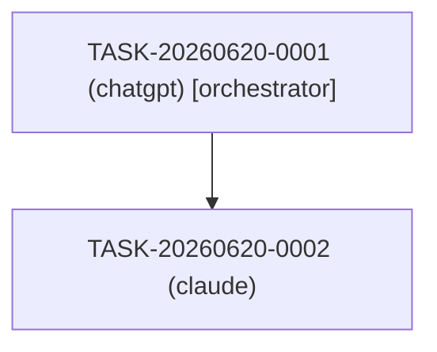

# tools/

Python scripts for indexing and searching session transcripts. No third-party packages required — only the Python 3 standard library (`sqlite3`, `os`, `sys`). The optional `PyYAML` package is used automatically if installed, but the scripts fall back to a built-in YAML parser if it is not.

---

## `index.py` — Build the search index

Walks the `sessions/` directory recursively and upserts every `.md` file it finds into a SQLite FTS5 database at `index/sessions.db`. Metadata (session ID, date, agent, model, repo, status, platform URL) is read from each session's `metadata.yaml`.

**Prerequisites:** Python 3.7+. No pip installs needed.

**Usage:**

```bash
python tools/index.py
```

**Sample output:**

```
[indexed] TASK-20260620-0001 (2 files)

Done. 1 session(s), 2 file(s) indexed into /path/to/AI-chat-logs/index/sessions.db
```

**Re-running is safe.** The indexer upserts session rows on each run, so running it multiple times produces no duplicates. When a session folder is deleted from disk, the indexer **tombstones** it instead of deleting rows: it sets `status = 'deleted'` in `session_meta` and prints `[tombstoned] TASK-ID (folder no longer exists)`. The transcript content is preserved in the FTS index. Run it after every new session commit.

---

## `search.py` — Search the index

Queries the FTS5 full-text index and prints matching sessions with context snippets.

**Prerequisites:** Python 3.7+. No pip installs needed. Run `index.py` first.

**Usage:**

```bash
# Basic full-text search
python tools/search.py "authentication flow"

# Search within a specific session
python tools/search.py "audit" --session TASK-20260620-0001

# Include tombstoned (deleted) sessions in results
python tools/search.py "authentication flow" --include-deleted

# Show help
python tools/search.py --help
```

**Sample output:**

```
Search results for: "audit"  [session: TASK-20260620-0001]
==========================================================

[1] TASK-20260620-0001
    Date     : 2026-06-20
    Agent    : chatgpt
    Repo     : gumfactor/AI-chat-logs
    File     : summary.md
    Context  : ...1. **A private >>>audit<<< repo** (`AI-chat-logs`) holds all conversation transcripts as version-controlled...

[2] TASK-20260620-0001
    Date     : 2026-06-20
    Agent    : chatgpt
    Repo     : gumfactor/AI-chat-logs
    File     : transcript.md
    Context  : ...This makes every merged PR a navigable >>>audit<<< record.
```

**Deleted sessions are excluded by default.** When sessions are tombstoned by the indexer (their folder was removed from disk), they are excluded from search results. Pass `--include-deleted` to include them. When results are excluded, a note is printed suggesting the flag.

**If the index does not exist**, the script prints a helpful error:

```
Error: index not found at .../index/sessions.db
Run `python tools/index.py` first to build the search index.
```

---

## How often to re-run the indexer

Run `python tools/index.py` after each new session folder is committed. It is fast (seconds, not minutes) even with hundreds of sessions, and running it multiple times is always safe.

A git post-commit hook or a simple cron job can automate this. See Phase 4 of `Plan.md` for planned automation options.

---

## `capture.py` — Capture a session transcript

Creates the full session folder structure from a raw transcript (file or stdin). Automatically assigns the next available Task ID for today, writes `transcript.md`, `metadata.yaml`, and a blank `summary.md`.

**Prerequisites:** Python 3.7+. No pip installs needed.

**Usage:**

```bash
# From a file
python tools/capture.py --file /path/to/transcript.txt

# From stdin — pipe text directly
echo "my transcript" | python tools/capture.py --agent claude

# From stdin — interactive paste (press Ctrl-D when done)
python tools/capture.py

# With pre-filled metadata
python tools/capture.py \
    --file /path/to/transcript.txt \
    --agent claude \
    --model claude-sonnet-4-6 \
    --repo gumfactor/my-project \
    --platform-url "https://claude.ai/chat/abc-123-uuid"

# Also run the indexer automatically after capture
python tools/capture.py --file transcript.txt --index
```

**Options:**

| Flag | Description |
|---|---|
| `--file PATH` | Read transcript from a file. If omitted, reads from stdin. |
| `--agent NAME` | Agent name: `claude`, `codex`, `gemini`, `chatgpt`, etc. |
| `--model MODEL` | Model string: `claude-sonnet-4-6`, `o4-mini`, etc. |
| `--repo ORG/REPO` | Repository the session worked on (e.g. `gumfactor/my-project`). |
| `--platform-url URL` | Canonical URL of the original chat (copy from browser address bar). |
| `--index` | Run `tools/index.py` automatically after capture (default: off). |

**Sample output:**

```
Session captured successfully.
  Task ID : TASK-20260620-0002
  Folder  : /path/to/AI-chat-logs/sessions/2026/2026-06-20/TASK-20260620-0002

  Files created:
    .../sessions/2026/2026-06-20/TASK-20260620-0002/transcript.md
    .../sessions/2026/2026-06-20/TASK-20260620-0002/metadata.yaml
    .../sessions/2026/2026-06-20/TASK-20260620-0002/summary.md
```

**What to do after capture:**

1. Open `metadata.yaml` and fill in any missing fields (`timestamp_end`, `branch`, `platform_url` if not provided).
2. After the session's PR is merged, update `metadata.yaml` with commit SHAs and the PR URL, and set `status: merged`.
3. Write the `summary.md` — including the **Self-Audit** section required by `AGENTS.md`.
4. Commit: `[TASK-ID] capture session transcript`.

---

## `dag.py` — Generate session DAG diagrams

Reads all `metadata.yaml` files in `sessions/` and generates a Mermaid `graph TD` diagram showing which sessions spawned which, using `subagent_sessions` (primary) and `parent_session` (fallback) fields.

**Prerequisites:** Python 3.7+. No pip installs needed.

**Usage:**

```bash
# Generate diagram for all sessions
python tools/dag.py

# Generate diagram rooted at a specific session (includes all descendants)
python tools/dag.py --root TASK-20260620-0041

# Write output to a file instead of stdout
python tools/dag.py --output /tmp/dag.md

# Append diagram to a session's summary.md (idempotent: skips if already present)
python tools/dag.py --root TASK-20260620-0041 \
    --append-to sessions/2026/2026-06-20/TASK-20260620-0041/summary.md

# Replace an existing DAG section in the file
python tools/dag.py --root TASK-20260620-0041 \
    --append-to sessions/2026/2026-06-20/TASK-20260620-0041/summary.md --force
```

**`--force` with `--append-to`:** If the file already contains a `<!-- dag:generated -->` marker, `--append-to` skips writing and prints "DAG section already present. Use --force to replace." Pass `--force` to replace the existing section instead of skipping. The marker appears exactly once in the output regardless of how many times the command is run.

**Sample output:**

````

````

**Node labels** use the format `"SESSION-ID (agent)"`. If `orchestrator: true` is set in the session's metadata, the label gets ` [orchestrator]` appended.

**Abandoned sessions** (those with `status: abandoned` in metadata) are rendered with a grey style: `style NODE_ID fill:#eee,color:#999`.

**Edge sources:** edges come from `subagent_sessions` in the parent's metadata. If that list is absent or empty, the `parent_session` field in the child's metadata is used as a fallback.

**If no relationships exist** across all sessions (all sessions are independent), the tool prints: `No parent/child relationships found. All sessions are independent.`

**Error handling:**
- `--root NONEXISTENT` — exits 1 with a clear error message
- Missing `metadata.yaml` — silently skips that session folder
- Circular references in parent/child chains — detected, skipped with a warning to stderr

---

## `generate_summary.py` — Create or update a session's summary.md with a DAG section

Creates a `summary.md` from the standard blank template (if it doesn't exist yet), and appends a Mermaid DAG section at the bottom. If `summary.md` already exists, the DAG section is only appended if it isn't already there (idempotent).

**Prerequisites:** Python 3.7+. No pip installs needed.

**Usage:**

```bash
python tools/generate_summary.py TASK-20260620-0041

# Replace an existing DAG section (e.g. after new subagents are added mid-task)
python tools/generate_summary.py TASK-20260620-0041 --force
```

**What it does:**

1. Finds the session folder for the given Task ID in `sessions/`.
2. If `summary.md` does not exist: creates it from the standard blank template and appends the Mermaid DAG section.
3. If `summary.md` already exists and does not contain the DAG marker: appends the DAG section.
4. If `summary.md` already exists and already contains the DAG marker: prints "DAG section already present. Nothing to do." and exits 0.
5. With `--force`: replaces the existing DAG section instead of skipping (useful when new subagents are added mid-task).

This is the "auto-generate the Mermaid diagram as part of `summary.md` once the task closes" behaviour described in Phase 5 of `Plan.md`.

**Sample output:**

```
Appended DAG section to: /path/to/sessions/2026/2026-06-20/TASK-20260620-0041/summary.md
```

On a second run (idempotency check):

```
DAG section already present in /path/to/.../summary.md. Nothing to do.
```
